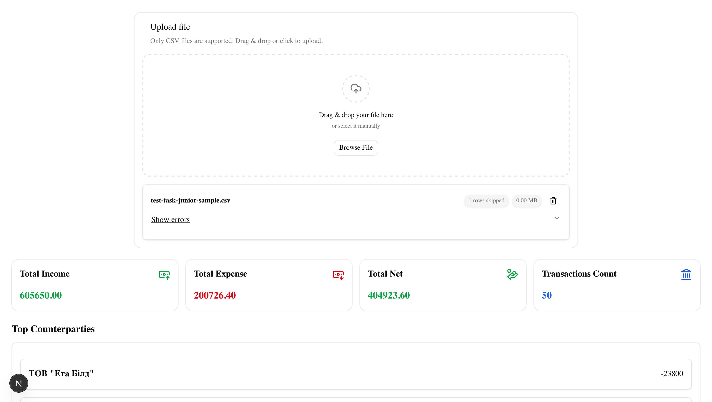

# Bank Statement Analyzed

## Як запустити:

1. Клонуйте репозиторій:

```bash
git clone https://github.com/AndriiSalohub/bank-statement-analyzer.git
```

2. Перейдіть в папку з проєктом:

```bash
cd bank-statement-analyzer
```

3. Встановіть залежності та запустіть:

```bash
npm install
npm run dev
```

## Про рішення

Було доволі цікаве завдання. Напевно, основна частина часу пішла на логіку завантаження та парсингу csv-файлів, бо доводилось робити схоже лише один раз, тому потрібн було переглядати й згадувати як це робити, також плюсом хотілось зробити цю частину візуально красиво, тому це також відіграло свою роль.
Також, неочікувано, значиний час пішов на функціонал зі зміни теми, бо хоча сама реалізація зайняла не багато часу, але почала з'являтись помилка з гідрацією, і найбільш простий фікс викликав помилку при лінтингу, тому знадобився час, щоб знайти рішення яке правильно в усіх аспектах відпрацьовувало.

**Посилання на відео**: [https://drive.google.com/file/d/17kGpJpm-NHZ4ee9TN2bKdskUfcugBQU1/view?usp=sharing](https://drive.google.com/file/d/17kGpJpm-NHZ4ee9TN2bKdskUfcugBQU1/view?usp=sharing)

- 
